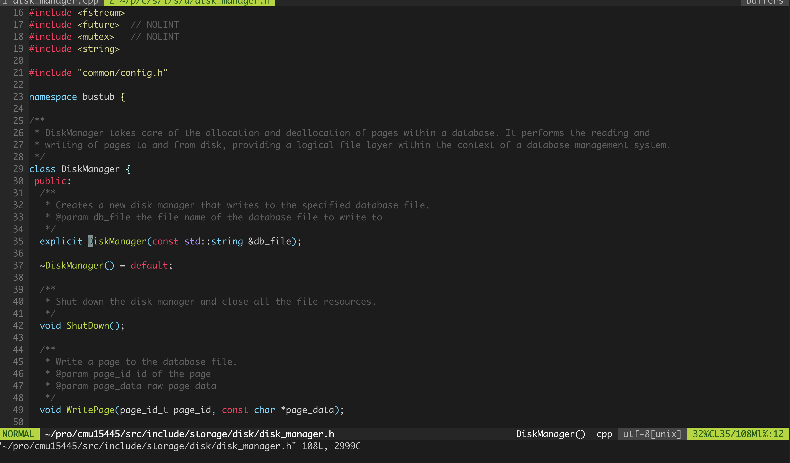
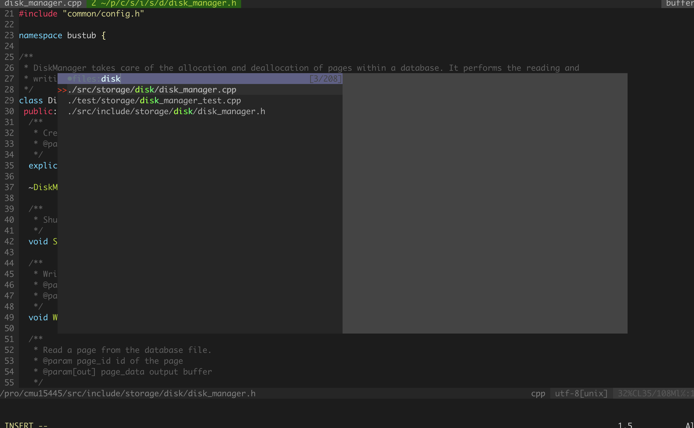
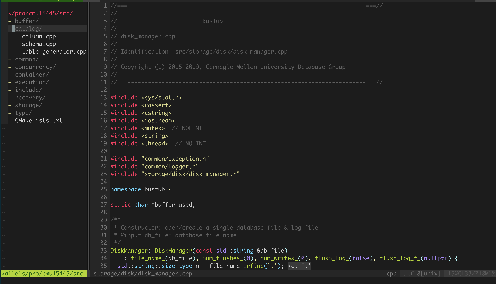
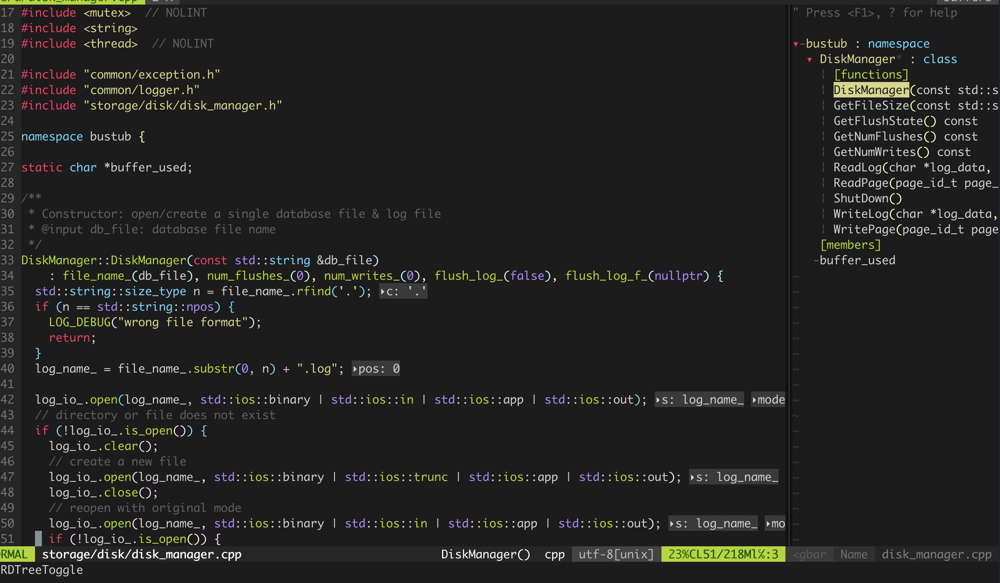
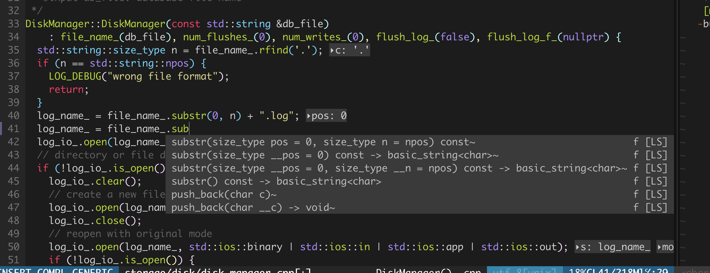

# Configure Steps

1. clone this repo

```
git clone https://github.com/chanchann/cc.vim.git
```

2. run instsall script

```
cd cc.vim

sudo apt update

chmod +x install.sh

sudo ./install.sh
```

3. install plugin

First open nvim 

```
nvim 

:PlugInstall
```

4. ccls for your project

The key is to generate compile_commands.json for your project

- For cmake : 

```
mkdir build && cd build
cmake -DCMAKE_EXPORT_COMPILE_COMMANDS=On ..
cd ..
ln -s build/compile_commands.json
```

or add in your CMakeList.txt

```cpp
set(CMAKE_EXPORT_COMPILE_COMMANDS ON)
```

For blade: 

```
blade dump --compdb --to-file compile_commands.json
```

## Introduction

1. Beautiful UI



2. File Manager

ctrl + p to find files quickly



3. Text Search

:Ag or :Rg 


4. File list

ctrl + f to open the file list



5. Tags

ctrl + t to open the tags



6. Code completion 



7. Format

Copy .clang-format to you project root
